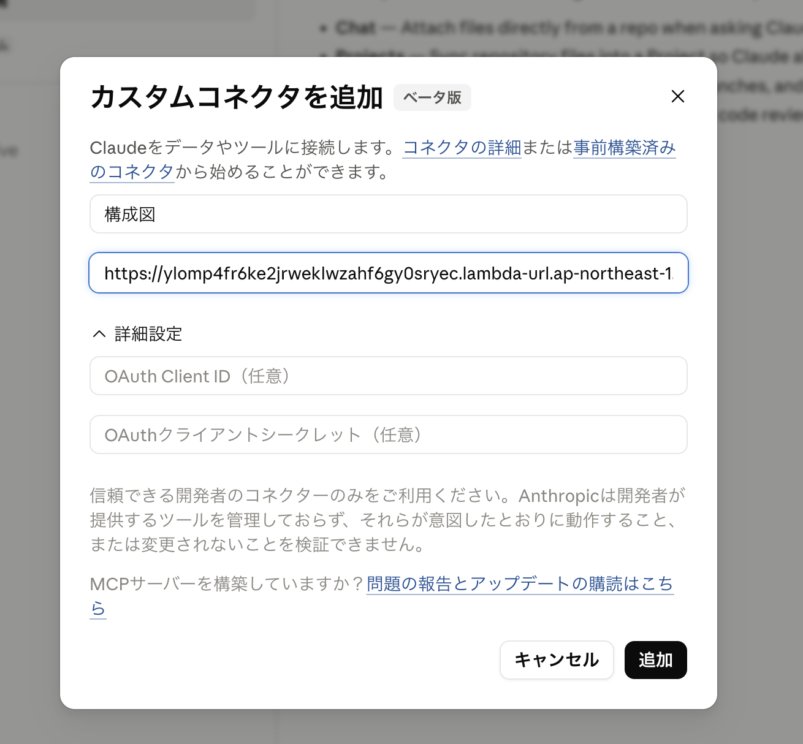
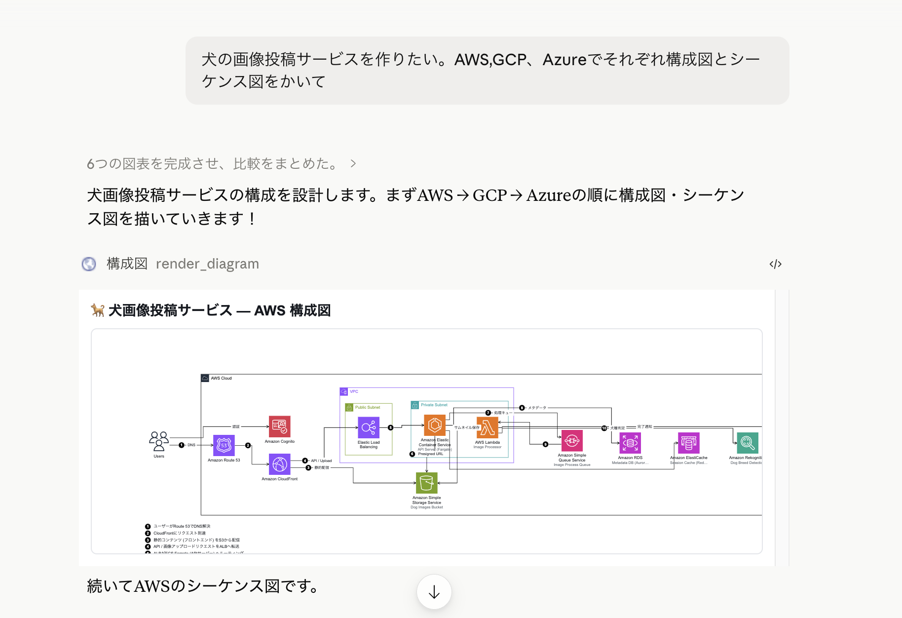
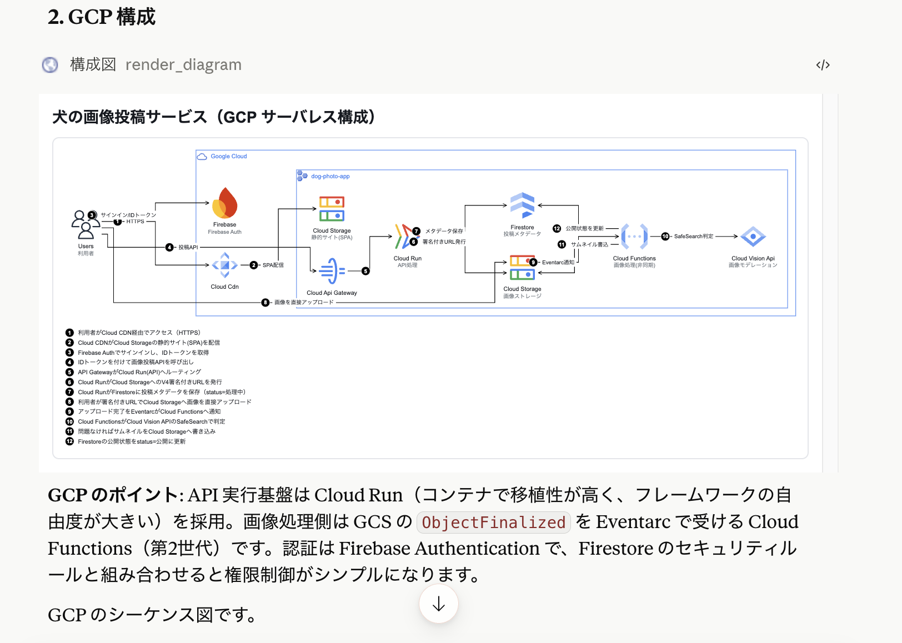
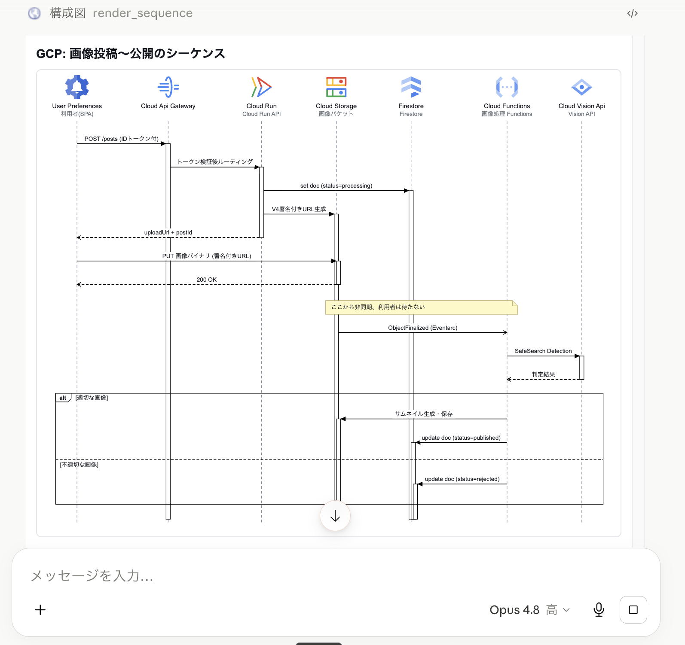
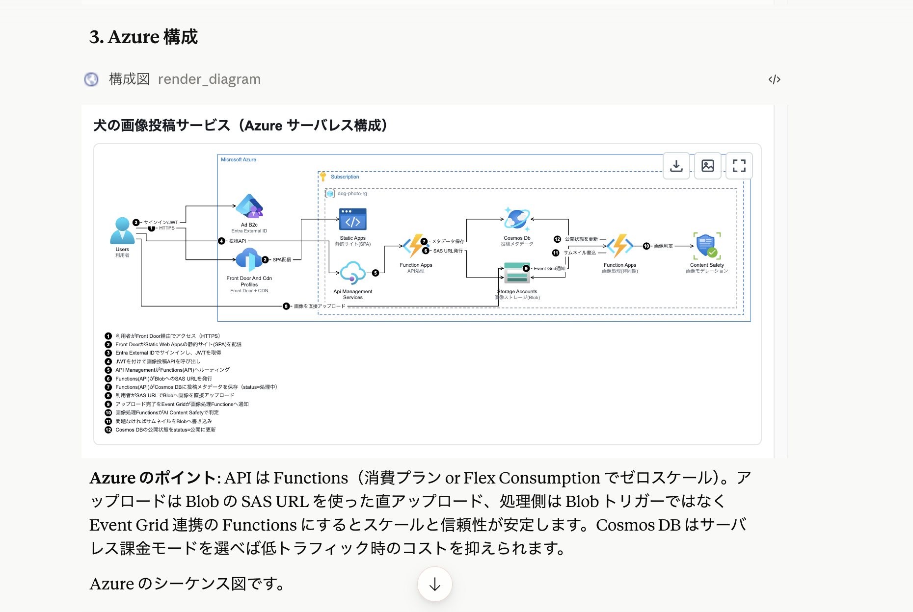
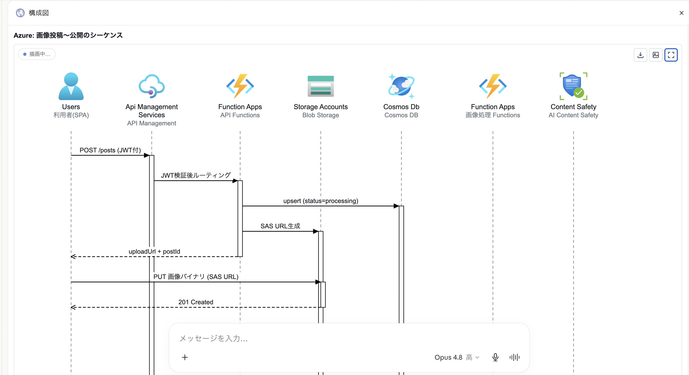
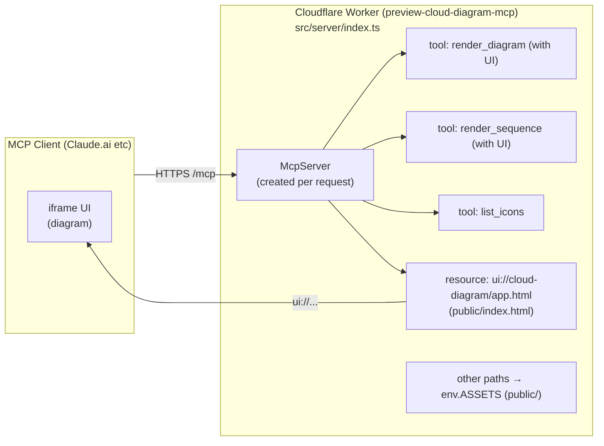
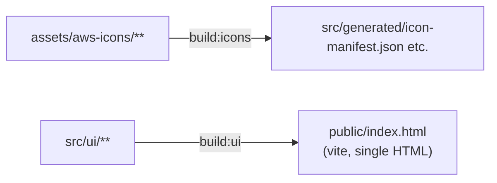

# Cloud Diagram MCP App (AWS / Azure / GCP / SaaS)

An [MCP Apps](https://github.com/modelcontextprotocol/ext-apps) server that renders interactive cloud architecture diagrams using official AWS, Azure, Google Cloud, and SaaS service icons. Runs on Cloudflare Workers and is accessible from MCP clients such as Claude.ai and Claude Code.

When Claude explains or proposes a cloud architecture, calling the `render_diagram` tool displays the diagram inline in the conversation. Elements are ordered from the traffic ingress side, and the UI renders progressively from the top as tool arguments stream in.


## Quick Start

A live instance is deployed at AWS Lambda Function URL. No setup required — just connect your MCP client.

**MCP Endpoint:**
```
https://ylomp4fr6ke2jrweklwzahf6gy0sryec.lambda-url.ap-northeast-1.on.aws/mcp
```

### Claude.ai

1. Open **Settings > Connectors**
2. Click **Add custom connector**
3. Paste the MCP endpoint URL above (no authentication required)
4. Ask Claude about a cloud architecture — it will call `render_diagram` and display the diagram inline



### Claude Code

Add to your MCP configuration:

```json
{
  "mcpServers": {
    "cloud-diagram": {
      "url": "https://ylomp4fr6ke2jrweklwzahf6gy0sryec.lambda-url.ap-northeast-1.on.aws/mcp"
    }
  }
}
```

### Verify the endpoint

```bash
curl -X POST https://ylomp4fr6ke2jrweklwzahf6gy0sryec.lambda-url.ap-northeast-1.on.aws/mcp \
  -H 'content-type: application/json' \
  -H 'accept: application/json, text/event-stream' \
  -d '{"jsonrpc":"2.0","id":1,"method":"initialize","params":{"protocolVersion":"2025-06-18","capabilities":{},"clientInfo":{"name":"curl","version":"0"}}}'
```

---

## Examples

Ask Claude to design an architecture and it generates diagrams for each cloud provider automatically.

### AWS Architecture


### GCP Architecture


### GCP Sequence Diagram


### Azure Architecture


### Azure Sequence Diagram


---

## Architecture

**Request flow**



**Build pipeline**



- `src/shared/diagram-spec.ts` — DiagramSpec type (shared contract between server and UI)
- `src/server/` — MCP server (Worker entry point)
- `src/ui/` — Diagram renderer (built into a single HTML by Vite → `public/index.html`)
- `src/generated/{aws,azure,gcp,saas}/icon-manifest.json` — Icon catalogs (AWS: 796, Azure: 619, GCP: 249, SaaS: 30)

## Setup

```bash
npm install

# Generate icon manifests (from assets/ to src/generated/)
npm run build:icons        # all providers: aws + azure + gcp + saas
npm run build:icons:saas   # SaaS icons only (30 services via simple-icons v15.7.0)

# Build UI (vite → public/index.html)
npm run build:ui

# Start local dev server (MCP endpoint: http://localhost:8787/mcp)
npx wrangler dev
```

Run `npm run dev` to execute `build:ui` and `wrangler dev` together.

## Deploy to Cloudflare

GitHub Actions automatically deploys on push to the `main` branch. Before that, configure the following Secrets under **Settings > Secrets and variables > Actions** in your repository.

| Secret | How to obtain |
|--------|--------------|
| `CLOUDFLARE_API_TOKEN` | [Cloudflare Dashboard](https://dash.cloudflare.com/profile/api-tokens) > Create Token > use the "Edit Cloudflare Workers" template |
| `CLOUDFLARE_ACCOUNT_ID` | Account ID shown on the right side of the Workers & Pages page in the Cloudflare Dashboard |

To deploy manually:

```bash
npm run deploy
```

After deployment, the MCP endpoint is `https://preview-cloud-diagram-mcp.<account>.workers.dev/mcp`.

## Deploy to AWS (Lambda Function URL)

In addition to Cloudflare Workers, deployment to AWS Lambda Function URL is also supported. MCP endpoint compatibility is the same.

See [`terraform/README.md`](terraform/README.md) for detailed instructions.

```bash
cd terraform
terraform init
terraform plan
terraform apply
```

After `apply` completes, register the output `mcp_endpoint` (e.g. `https://xxxx.lambda-url.ap-northeast-1.on.aws/mcp`) in your MCP client.

## Register with Claude.ai (Custom Connector)

1. Open **Settings > Connectors** in Claude.ai
2. Click **Add custom connector**
3. Enter `https://preview-cloud-diagram-mcp.<account>.workers.dev/mcp` as the URL (no authentication required)
4. After adding, ask Claude about a cloud architecture and it will call `render_diagram` to display the diagram

Example: "Show me a typical web architecture with CloudFront + ALB + ECS"

## Tool Specification

All tools require a **`provider`** argument (`"aws"` / `"azure"` / `"gcp"` / `"saas"` / `"multi"`). Write it first in the arguments for streaming rendering.

- `"saas"` — SaaS service icons (Vercel, Supabase, Firebase, Cloudflare, Stripe, GitHub, Docker, Kubernetes, etc. — 30 services)
- `"multi"` — mix icons from multiple providers in one diagram using prefixed IDs (`aws-lambda`, `azure-functions`, `gcp-cloud-run`, `saas-vercel`)

### render_diagram (UI-enabled tool)

Renders a cloud architecture diagram (AWS / Azure / Google Cloud). The result is displayed inline in the UI at `ui://cloud-diagram/app.html`.

Input:

| Field | Type | Description |
|-------|------|-------------|
| `provider` | `"aws"\|"azure"\|"gcp"\|"saas"\|"multi"` | Cloud/SaaS provider (**write first**) |
| `title` | `string?` | Diagram title |
| `elements` | `DiagramElement[]` | Components. **Order from ingress (user/client) following the traffic flow.** Declare groups before their children |

`DiagramElement` (discriminated union by `type`):

- **group** — `{ type: "group", id, kind, label?, parent? }`
  - AWS `kind`: `aws-cloud` / `region` / `vpc` / `availability-zone` / `public-subnet` / `private-subnet` / `security-group` / `auto-scaling-group` etc.
  - Azure `kind`: `azure-cloud` / `azure-subscription` / `azure-resource-group` / `azure-vnet` / `azure-subnet` etc.
  - GCP `kind`: `gcp-cloud` / `gcp-project` / `gcp-vpc` / `gcp-region` / `gcp-zone` / `gcp-subnet` etc.
  - Cross-provider `kind`: `c4-system-boundary` / `c4-container-boundary` (C4 model-style dashed boundary) / `pipeline-stage` (CI/CD pipeline stage)
  - Nesting example (Azure): `azure-subscription > azure-resource-group > azure-vnet > azure-subnet`
  - Nesting example (GCP): `gcp-project > gcp-vpc > gcp-region > gcp-zone`
- **node** — `{ type: "node", id, icon, name?, tech?, description?, parent? }`
  - `icon`: icon ID or alias
    - AWS: `amazon-ec2`, `aws-lambda`, aliases `s3` / `alb` / `rds` etc.
    - Azure: `azure-virtual-machine`, aliases `vm` / `aks` / `cosmos` etc.
    - GCP: `gcp-compute-engine`, aliases `gke` / `gcs` / `bq` / `pubsub` etc.
    - SaaS: `saas-vercel`, `saas-supabase`, aliases `vercel` / `stripe` / `github` / `k8s` etc.
    - Multi: use prefixed IDs (`aws-lambda`, `azure-functions`, `gcp-cloud-run`, `saas-vercel`)
  - `name`: resource-specific name (optional). Service label is auto-applied from the icon
  - `tech`: C4-style technology label shown as `[Tech]` under the name (e.g. `"React"`, `"Node.js"`)
  - `description`: C4-style short description shown in small text (up to 4 lines)
- **edge** — `{ type: "edge", from, to, label?, direction?, style? }`
  - `direction`: `forward` (default) / `both` / `none`
  - `style`: `"solid"` (default) / `"dashed"` — use `"dashed"` for webhooks, triggers, and async flows

Output: `content` contains a summary, `structuredContent` contains `{ kind: "architecture", spec: normalizedDiagramSpec, warnings: string[] }`. Icon IDs are normalized via alias resolution, prefix completion, and partial matching. Unresolvable icons or edges referencing non-existent IDs are recorded in `warnings` (elements themselves are preserved).

### render_sequence (UI-enabled tool)

Renders communication flows and processing sequences between cloud services as a UML-compliant sequence diagram. The result is displayed inline in the same UI at `ui://cloud-diagram/app.html`. The UI distinguishes between architecture and sequence diagrams based on `structuredContent.kind`. Use `render_diagram` for static structure and this tool for dynamic message flows.

Input:

| Field | Type | Description |
|-------|------|-------------|
| `provider` | `"aws"\|"azure"\|"gcp"\|"saas"\|"multi"` | Cloud/SaaS provider (**write first**) |
| `title` | `string?` | Diagram title |
| `participants` | `SequenceParticipant[]` | Lifelines. **Order from left to right, traffic ingress first** (user/client at far left) |
| `events` | `SequenceEvent[]` | Event sequence **in chronological order from top** |

`SequenceParticipant` — `{ id, icon, name? }`
- `icon`: cloud service icon ID or alias (searchable via `list_icons`). Generic icons like `user`, `client`, `internet` are also available for non-AWS providers
- `name`: resource-specific name (optional). Service label is auto-applied from the icon

`SequenceEvent` (discriminated union by `type`):

- **message** — `{ type: "message", from, to, label, kind?, activate?, deactivate? }`
  - `kind`: `sync` (default, synchronous call / filled arrowhead) / `async` (asynchronous / open arrowhead) / `return` (response / dashed line) / `self` (self-call)
  - `label` should describe the specific operation (e.g. `"PutItem (orders table)"`, `"POST /api/orders"`)
- **fragment / else / end** — combined fragments. Open with `{ type: "fragment", kind: "alt" | "opt" | "loop" | "par" | "break", label? }` and close with `{ type: "end" }`. Separate `alt` branches with `{ type: "else", label? }`
- **note** — `{ type: "note", over: string[], text }`. Supplementary note spanning multiple lifelines

Output: `content` contains a summary (participant count, message count, warnings), `structuredContent` contains `{ kind: "sequence", spec: normalizedSequenceSpec, warnings: string[] }`. Participant icon IDs are normalized by the same rules as `render_diagram`. Unresolvable icons, references to undeclared participants, and fragment mismatches (extra `end`, unclosed, `else` outside `alt`) are recorded in `warnings` (elements themselves are preserved).

### list_icons

Searches for icon IDs usable in `render_diagram` / `render_sequence` `icon` fields. Includes catalogs of AWS (796), Azure (619), GCP (249), and SaaS (30) icons.

| Argument | Type | Description |
|----------|------|-------------|
| `provider` | `"aws"\|"azure"\|"gcp"\|"saas"` | Provider to search |
| `query` | `string?` | Partial match on ID, name, or alias (case-insensitive) |
| `category` | `string?` | Filter by category (e.g. `Compute`, `Database`, `DevOps & CI/CD`) |

Returns up to 50 results as `{id, name, category}`. Calling without `query`/`category` returns a category list with counts.

## Usage Examples

### Multi-cloud diagram

Use `provider: "multi"` to mix AWS, Azure, GCP, and SaaS icons in one diagram. Prefer prefixed IDs to avoid ambiguity. Unprefixed names resolve in order: aws → azure → gcp → saas.

```json
{
  "provider": "multi",
  "title": "SaaS + AWS backend",
  "elements": [
    { "type": "node", "id": "fe",  "icon": "saas-vercel",   "name": "Frontend" },
    { "type": "node", "id": "api", "icon": "aws-lambda",    "name": "API" },
    { "type": "node", "id": "db",  "icon": "saas-supabase", "name": "Database" },
    { "type": "edge", "from": "fe",  "to": "api", "label": "HTTPS" },
    { "type": "edge", "from": "api", "to": "db",  "label": "SQL" }
  ]
}
```

### C4 model-style diagram

Use `c4-system-boundary` / `c4-container-boundary` groups and the `tech` / `description` node fields to draw C4 context or container diagrams.

```json
{
  "provider": "multi",
  "title": "C4 Container View",
  "elements": [
    { "type": "group",  "id": "sys", "kind": "c4-system-boundary", "label": "E-Commerce System" },
    { "type": "node",   "id": "web", "icon": "saas-vercel",  "name": "Web App",
      "tech": "Next.js", "description": "Server-side rendered storefront", "parent": "sys" },
    { "type": "node",   "id": "api", "icon": "aws-lambda",   "name": "Order API",
      "tech": "Node.js", "description": "Handles orders and payments",     "parent": "sys" },
    { "type": "node",   "id": "pay", "icon": "saas-stripe",  "name": "Stripe" },
    { "type": "edge", "from": "web", "to": "api", "label": "REST" },
    { "type": "edge", "from": "api", "to": "pay", "label": "Charge" }
  ]
}
```

### CI/CD pipeline diagram

Use `pipeline-stage` groups for pipeline stages and `style: "dashed"` edges for webhook or trigger flows.

```json
{
  "provider": "saas",
  "title": "CI/CD Pipeline",
  "elements": [
    { "type": "group", "id": "ci",  "kind": "pipeline-stage", "label": "CI" },
    { "type": "group", "id": "cd",  "kind": "pipeline-stage", "label": "CD" },
    { "type": "node",  "id": "gh",  "icon": "saas-github",         "name": "GitHub",         "parent": "ci" },
    { "type": "node",  "id": "gha", "icon": "saas-github-actions",  "name": "GitHub Actions", "parent": "ci" },
    { "type": "node",  "id": "reg", "icon": "saas-docker",          "name": "Container Registry", "parent": "cd" },
    { "type": "node",  "id": "k8s", "icon": "saas-kubernetes",      "name": "Kubernetes",     "parent": "cd" },
    { "type": "edge", "from": "gh",  "to": "gha", "label": "push",   "style": "dashed" },
    { "type": "edge", "from": "gha", "to": "reg", "label": "push image" },
    { "type": "edge", "from": "reg", "to": "k8s", "label": "deploy",  "style": "dashed" }
  ]
}
```

## SaaS Icon License

SaaS logos are used **for identification purposes only**. Trademarks belong to their respective owners. This project is not affiliated with any of the listed services. Official SVGs are sourced from each service's brand guidelines; remaining icons are from [simple-icons](https://github.com/simple-icons/simple-icons) v15.7.0 (CC0-1.0). See [`assets/saas-icons/SOURCES.md`](assets/saas-icons/SOURCES.md) for a full per-icon attribution table.

## Development

```bash
npm run typecheck   # type check
```

Local verification (MCP handshake):

```bash
curl -s http://localhost:8787/mcp \
  -H "Content-Type: application/json" \
  -H "Accept: application/json, text/event-stream" \
  -d '{"jsonrpc":"2.0","id":1,"method":"initialize","params":{"protocolVersion":"2025-06-18","capabilities":{},"clientInfo":{"name":"curl","version":"0.0.0"}}}'
```
